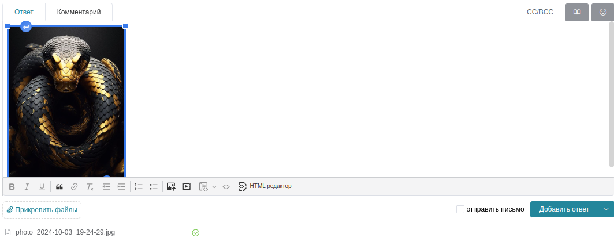

# Tech Support Bot

A [TG bot](https://t.me/across_tech_bot) for creating tickets, viewing ticket status for Technical Support Service and fetching articles from Knowledge Base from HelpDeskEddy.

## FEATURES

- Receive tech support requests
- Provide contact info to users
- Send support tickets to HelpDeskEddy via API
- Receive ticket status update from HelpDeskEddy via API
- Receive FAQ articles from HelpDeskEddy via API

## DEPENDENCIES

- [aiogram](https://github.com/aio-libs/aiohttp)
- [python-dotenv](https://github.com/theskumar/python-dotenv)
- [aiosqlite](https://github.com/aiosqlite/aiosqlite)
- [sqlalchemy](https://github.com/sqlalchemy/sqlalchemy)
- [flask](https://github.com/pallets/flask)
- [nginx](https://www.nginx.com/)
- [gunicorn](https://docs.gunicorn.org/en/stable/)
- [apache2-utils](https://httpd.apache.org/docs/2.4/mod/mod_auth_basic.html)
- [celery](https://docs.celeryq.dev/en/stable/userguide/first-steps-with-celery.html)
- [redis](https://redis.io/)
- [requests](https://github.com/psf/requests)

## INSTALLATION

```bash
python3 -m venv venv
source venv/bin/activate
pip install -r requirements.txt
sudo apt install nginx apache2-utils
```

## NGINX server configuration

1) Add the following to `/etc/nginx/sites-available/default`:

```nginx
server {
    listen 8087;
    server_name ftp.across.ru;

    auth_basic "Restricted";
    auth_basic_user_file /etc/nginx/.htpasswd;

    location / {
        proxy_pass http://127.0.0.1:5000;
        proxy_set_header Host $host;
        proxy_set_header X-Real-IP $remote_addr;
        proxy_set_header X-Forwarded-For $proxy_add_x_forwarded_for;
        proxy_set_header X-Forwarded-Proto $scheme;
    }
}
```

2) Configure `/etc/nginx/.htpasswd`:

```nginx
sudo htpasswd -c /etc/nginx/.htpasswd across
```

Enter password when prompted

3) Test the configuration: ```sudo nginx -t```

4) Restart Nginx: ```sudo systemctl restart nginx```

## REDIS configuration

```bash
sudo nano /etc/sysctl.conf
```

Add to the end of file:

```bash
vm.overcommit_memory = 1
```

Save and apply changes:

```bash
sudo sysctl -p
```

## RUNNING

```bash
sudo docker-compose build
sudo docker-compose up
```

## NOTES ON WEBHOOK PICTURE RECEIVING

Employees must send the picture as shown on the screenshot. The picture MUST be visible in the text field. And no more than 1 picture is to be sent in a reply.

